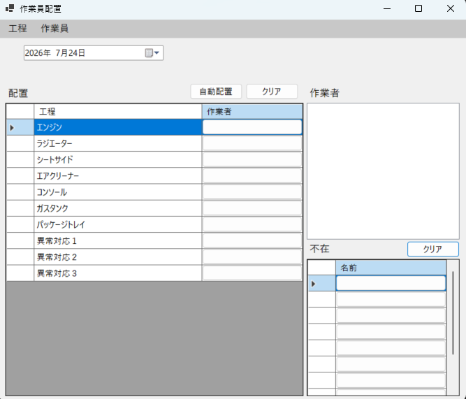
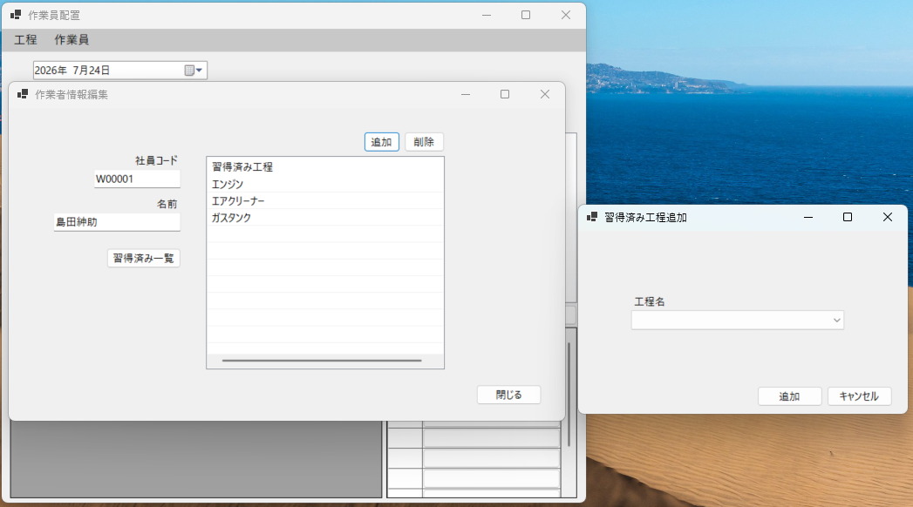
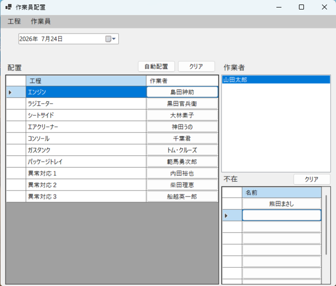

# Employee Assignment App

## 概要

作業員を各工程へ配置するための業務支援アプリケーションです。

作業員ごとに作業可能な工程を設定し、各工程に対して作業員を手動または自動で配置できます。

自動配置と手動配置を組み合わせることも可能で、現場の状況に応じた柔軟な作業員配置を行えます。

---

## 使用技術

- C#
- .NET
- Windows Forms
- Entity Framework Core
- SQLite
- LINQ

---

## 主な機能

### 作業員管理

- 作業員の登録
- 作業員の削除
- 作業員一覧の表示
- 作業員ごとの作業可能工程の編集

---

### 工程管理

- 工程の追加
- 工程の削除

---

### 作業員の工程配置

各工程に対して、作業員を配置できます。

- ダブルクリックによる作業員の割り当て、割り当てた作業員の個別クリア
- クリアボタンによるすべての割り当てのクリア
- 自動配置
- 手動配置
- 自動配置と手動配置の組み合わせ

また、工程行を選択すると、その工程で作業可能な作業員だけを作業員リストに表示します。

これにより、作業員のスキルを確認しながら配置できます。

---

### 不在者管理

不在者を管理し、配置対象から除外できます。

- 不在者一覧への作業員の登録
- ダブルクリックによる不在者の割り当て、不在者割り当ての個別クリア
- クリアボタンによる不在者割り当ての全クリア

---

### 自動配置

作業員の作業可能工程や不在状況を考慮し、作業員を自動で各工程へ配置します。

同じメンバーでも毎回同じ配置にならないように配置ロジックにランダム要素を取り入れました。

また、自動配置が成立しない場合は、配置できないことをメッセージで通知します。

これにより、配置後に必要人数を満たしていない状態を見逃しにくくしています。

---

## アプリ画面

### メイン画面

### 作業員情報編集画面

### 割当済み画面

---

## 動作デモ
https://youtu.be/0uk8RNi6PmA

---

## 操作方法

---

